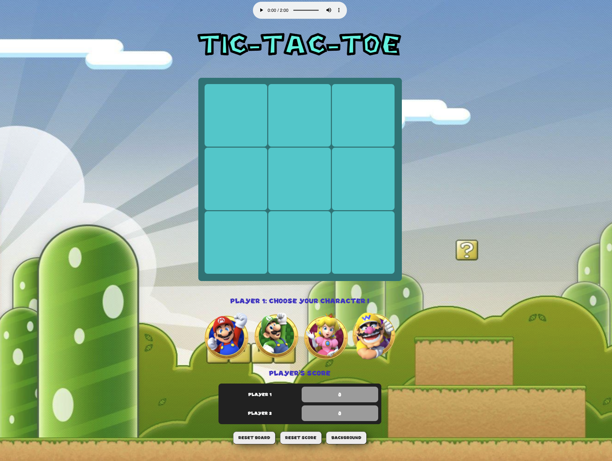
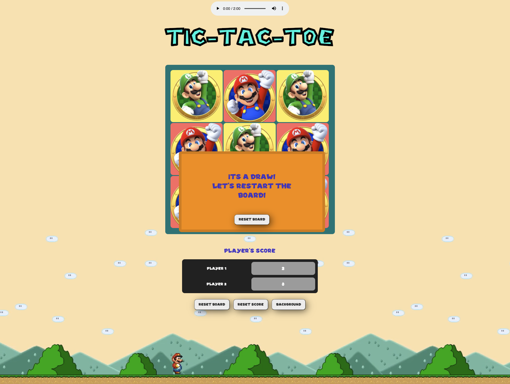
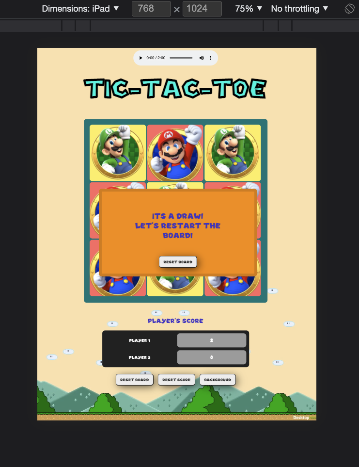

# TIC TAC TOE - GA Project 1

A **SuperMario** themed Tic Tac Toe. 
[This is a link to my live site](https://azhang93.github.io/tic-tac-toe/?fbclid=IwAR019QX2QN2GVKgiOYhSLdG00LA_Fz00SV6KxQ0LXjlYZK5NDEu1lOFGedo)

**HOW TO PLAY**
Before starting the game, players first have to choose their characters.
Once selected, the game will start and a pop up message will show up for every draw, win situations. 
The pop-up message will propmt users to restart the board to continue the game. The reset board button will only clear the grid but will keep count of the winning scores.

If players wants to start the game from the beggining, they can reset the whole game and once again pick their characters.

Added bonus, you can change the background to your liking! and an audio player for Mario's classic soundtrack.

Tech used in this project:
- HTML, CSS, JS , Jquery
- media queries for screen resize

Wishlist:
- cell's color change according to different character selection
- sound effects while hovering character selection
- AI player option
- Custom Grid options

List of bugs:
- May encounter a draw message after win message of a diagonal win: on a last remaining corner cell of the grid.

Experience with project:

- A lot of fun while creating the game, especially with the design of the game and having the option of character selections: leads to more options with different themes.

- progressively have a much clearer understanding of where the errors are coming from and finding a solution for them.

- Will continue to update the game with the goal to incorporate another selection option of an AI player. 

More Images:

